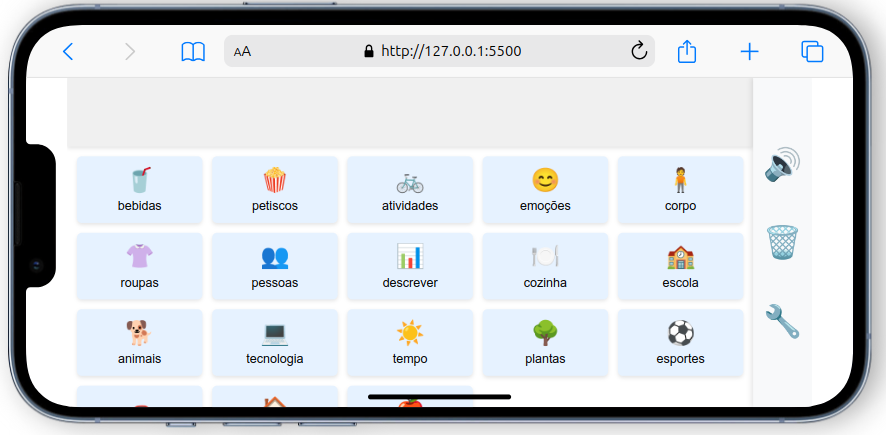

# Emotalk

**Emotalk** é um aplicativo de comunicação aumentativa e alternativa (CAA) que usa emojis para expressar ideias e sentimentos. Inclui **Colourful Semantics** (cores por papel na frase), **Shape Coding** (formas por papel), **SVOMPT** (ordem da frase), **Moldes de frase** (sentence frames), **Quadros** (Frame Semantics / Fillmore), **Ícones centrais** (MINSPEAK / compação semântica), uso offline (PWA), barra de frase com persistência, reordenar por arrastar e soltar, configurações (velocidade da fala, fonte maior, idioma pt-BR/EN), **histórico das frases faladas** e acessibilidade.



## Funcionalidades

- **Idiomas (pt-BR e EN):** Interface e síntese de fala em Português (Brasil) ou English; Configurações → Geral.
- **PWA (offline):** Instale e use sem internet; service worker faz cache do app.
- **Colourful Semantics:** Categorias e palavras com cores por papel na frase (Quem, O quê faz, O quê, Onde, Quando, Como/Descrever); ativar/desativar em Configurações → Legenda.
- **Shape Coding:** Formas distintas por papel gramatical; ativar em Configurações → Legenda.
- **SVOMPT:** Ordenar frase ao falar, barra com slots S-V-O-M-P-T, modo guiado, ordenar barra; Configurações → SVOMPT.
- **Moldes de frase (Sentence Frames):** Frases com um espaço (ex.: «Eu quero ___»); botão Moldes (📝); Configurações → Moldes.
- **Quadros (Frame Semantics / Fillmore):** Quadros com vários papéis (ex.: Dar = quem dá, o quê, a quem); botão Quadros (🖼️); Configurações → Quadros (Fillmore).
- **Ícones centrais (MINSPEAK):** Primeiro ecrã com 6 ícones; acesso em 2 toques; Configurações → Ícones centrais.
- **Barra de frase:** Monte a frase com pictogramas; falar ou limpar; barra salva no navegador.
- **Arrastar e soltar:** Reordene pictogramas na barra (desktop).
- **Configurações:** Modal com menu (Geral, SVOMPT, Legenda, Histórico, Moldes, Ícones centrais, Quadros); velocidade da fala, fonte maior, idioma, histórico.
- **Histórico de uso:** Frases faladas são registradas (até 200); visualização e limpeza em Configurações → Histórico.
- **Acessibilidade:** Navegação por teclado, ARIA, opção de fonte maior.
- **Emojis:** Vocabulário com emojis na prancha.

## Tecnologias

- **PWA:** manifest.json, service worker (sw.js).
- **Front-end:** HTML, CSS em `assets/css/index.css`, JavaScript em `assets/js/index.js`, vocabulário em `assets/js/vocabulary.js`, moldes em `assets/js/sentenceFrames.js`, quadros Fillmore em `assets/js/frameSemantics.js`, ícones centrais em `assets/js/minspeak.js`, traduções em `assets/js/translations.js`.
- **Speech Synthesis API:** Vocalização em pt-BR ou inglês conforme o idioma.

## Documentação

Documentação completa (EN e PT-BR): [índice Jekyll](index.md) · [pt-BR](docs/pt-br/README.md) · [English](docs/en/README.md). Inclui [Recursos e justificativas](docs/pt-br/RECURSOS.md), [Vocabulário](docs/pt-br/VOCABULARY.md), [Colourful Semantics](docs/pt-br/COLOURFUL_SEMANTICS.md), [Frame Semantics (Fillmore)](docs/pt-br/FRAME_SEMANTICS.md), [MINSPEAK](docs/pt-br/MINSPEAK.md), [Gramática de Dependências](docs/pt-br/DEPENDENCY_GRAMMAR.md) e [Case Grammar](docs/pt-br/CASE_GRAMMAR.md).

## Instalação e Execução

Para executar o Emotalk localmente, siga estes passos:

1. **Clone o repositório:**

   ```bash
   git clone https://github.com/aac-ai-lab/emotalk.git
   ```

2. **Navegue para o diretório do projeto:**

   ```bash
   cd emotalk
   ```

3. **Abra o arquivo `index.html` no seu navegador ou inicie um servidor local:**

   ```bash
   npx http-server
   ```

4. **Acesse o aplicativo em:**

   ```bash
   http://localhost:8080
   ```

## Contribuição

Contribuições são bem-vindas! Para contribuir com o projeto, siga estas etapas:

1. **Fork o repositório**
2. **Crie uma nova branch:**

   ```bash
   git checkout -b feature/new-feature
   ```

3. **Faça suas alterações e commit:**

   ```bash
   git add .
   git commit -m "Adiciona nova funcionalidade"
   ```

4. **Push para o repositório remoto:**

   ```bash
   git push origin feature/new-feature
   ```

5. **Crie um Pull Request**

## Licença

Este projeto é licenciado sob a Licença MIT - veja o arquivo [LICENSE](LICENSE) para detalhes.

## Contato

Se você tiver perguntas ou sugestões, entre em contato através do e-mail: [franciscosouzaacer@gmail.com](mailto:franciscosouzaacer@gmail.com).